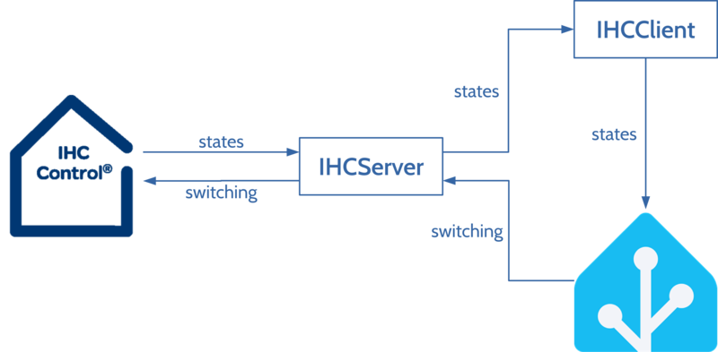
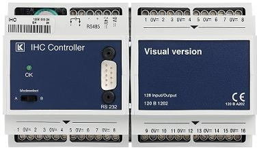

# IHCClient

IHCClient is a Python script, enabling the communication between older IHC
Controllers (without _ethernet_ interface) and Home Assistant.

The heavy lifting is done by [IHCServer](https://github.com/skumlos/ihcserver)
from Martin Hejnfelt.

The IHCServer communicates with the IHC Controller via the RS485 interface,
enabling reading the statuses of the inputs and outputs as well as switching
the outputs to desired states.

The IHCClient connects to the IHCServer to receive the status updates of the
inputs and outputs via _WebSocket_ protocol and sends them to the Home
Assistant via the REST API. To switch the outputs, the Home Assistant sends
http requests to the IHCServer.

The communication between the components can be seen in the following figure:

IHCClient performs the following functions:

- establishes a http connection to the IHCServer
- requests the initial states of all inputs and outputs from the IHCServer
- sets the initial states of the sensors and switches in the Home Assistant
- establishes a WebSocket connection to the IHCServer
- listens to the events of state changes from the IHCServer
- updates the states of the sensors and switches in the Home Assistant

## Hardware requirements

- IHC Controller (the one with RS232 port on the front panel)
- USB to RS485 dongle (connected to the RS485 pins of the controller)
- a PC for running the software (Raspberry Pi will do fine)

## Installation

Follow these step-by-step guides:

- [How to install and connect the USB to RS485 dongle](docs/USBtoRS485.md)
- [How to install and configure the IHCServer](docs/IHCServer.md)
- [How to install and configure the IHCClient](docs/IHCClient.md)
- [How to configure the entities in Home Assistant](docs/HACONFIG.md)

Bonus tracks:

- [Notes about IHC dimmers](docs/IHCdimmers.md)
- [How to control the dimmers with Home Assistant](docs/HAdimmers.md)
